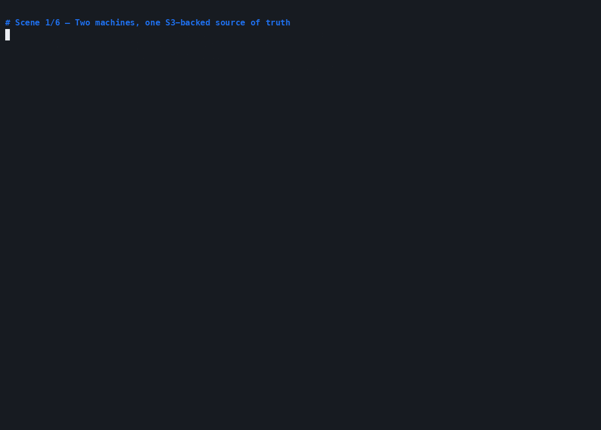

# Polign memory demo on dstack

This demo runs an S3-backed agent memory system inside a dstack confidential
VM. S3 is the database: acknowledged memories are written to the bucket before
the tool call returns, while the CVM and its local volumes are disposable.

The VM contains:

- the browser chat and read-only typed-memory inspector
- Polign, using a dedicated S3 prefix as its durable source of truth
- an authenticated gateway as the only published service
- sealed model-provider and AWS source credentials
- local Polign and embedding-model caches that can be rebuilt from scratch

Polign's HTTP and gRPC ports stay on the private Compose network. Only the
authenticated browser gateway is published.

## Demo: replace the machine, keep the memory



The recording starts Machine A with an S3-backed Polign store and writes seven
typed records. It then kills the agent and Polign without a graceful shutdown
and deletes every container, cache, and local volume owned by Machine A.

Machine B starts as a separate Compose project with empty local volumes and the
same S3 prefix. In a new OpenAI conversation it recovers the profile, replaces
Seattle with Portland and Go with Rust, and retains the old values as
superseded history.

The transcript does not survive the handoff; the typed memory does. That is the
architecture this demo is intended to prove.

## S3 configuration

Create or choose an S3 bucket and give this deployment its own prefix:

```sh
POLIGN_STORE=s3://my-polign-bucket/memory-demo
POLIGN_STORE_REGION=us-west-2
```

Do not share one prefix between unrelated deployments. Polign stores its write
log, collection metadata, and immutable segments beneath that prefix.

### Role-based credentials

The recommended configuration separates the credential sealed into the CVM
from the identity that can read and write memory:

```text
sealed source key -> AWS STS AssumeRole -> short-lived store-role credentials -> S3 prefix
```

Configure the source identity with:

```sh
AWS_ACCESS_KEY_ID=...
AWS_SECRET_ACCESS_KEY=...
```

The source principal should have only `sts:AssumeRole` permission on one store
role. It does not need direct access to S3.

Configure the target store role with:

```sh
POLIGN_STORE_ROLE_ARN=arn:aws:iam::123456789012:role/polign-memory-store
POLIGN_STORE_EXTERNAL_ID=<random deployment-specific value>
```

The store role's trust policy must name the source principal, allow
`sts:AssumeRole`, and require the same external ID. Its permissions policy
should grant:

- `s3:GetObject`, `s3:PutObject`, and `s3:DeleteObject` on the dedicated prefix
- `s3:ListBucket` on the bucket, restricted to the dedicated prefix

Polign calls STS and signs S3 requests with the returned short-lived
credentials. The AWS SDK caches and refreshes those role credentials before
they expire.

Phala is not an EC2 instance and does not automatically receive an AWS
instance role. `POLIGN_STORE_ROLE_ARN` therefore still needs a usable source
credential. Phala seals the environment supplied at deployment time; keeping
the source principal limited to `sts:AssumeRole` minimizes what that sealed key
can do.

Direct S3 credentials work when `POLIGN_STORE_ROLE_ARN` is omitted, but they
give the sealed key access to the data and are not the recommended path.

## Configure the demo

Copy the example environment file and fill in the S3, AWS, browser, model, and
immutable image values:

```sh
cd dstack
cp .env.example .env
openssl rand -hex 32
```

Put the generated value in `DSTACK_PASSWORD`. The `.env` file is ignored by
Git and must never be committed.

For OpenAI:

```sh
MODEL_PROVIDER=openai
MODEL=gpt-5
OPENAI_API_KEY=...
```

For Anthropic, set `MODEL_PROVIDER`, `MODEL`, and `ANTHROPIC_API_KEY` instead.
`OPENAI_BASE_URL` can target an OpenAI-compatible endpoint.

## Record the S3 machine-failover demo

With `.env` configured, run:

```sh
./record-demo.sh
```

`record-demo.sh` runs the S3 failover scenario. It updates
`dstack-s3-failover-demo.gif` and writes a Git-ignored
`dstack-s3-failover-demo.cast`. Neither the bucket URI nor any credential is
printed or recorded.

The recorder uses two isolated Compose projects against the same S3 prefix.
Only one machine runs at a time, and it deletes Machine A's local volumes
before Machine B starts.

## Local smoke test

The smoke test explicitly opts into `fs:/var/lib/polign/store` so it can check
image startup, private routing, gateway authentication, and the inspector
without touching AWS or a model API:

```sh
./smoke-test.sh
```

That filesystem store is disposable test data. It is not the deployment's
persistence model and is never selected implicitly by the base Compose file.

## Publish the application image

The repository workflow publishes multi-architecture images to
`ghcr.io/polign/polign-memory-demo`. Its job summary prints an immutable
reference:

```text
ghcr.io/polign/polign-memory-demo@sha256:...
```

Set that value as `MEMORY_DEMO_IMAGE`. Do not deploy `latest` or another mutable
tag: the image reference is part of the attested Compose configuration.

Polign itself is not redistributed in the application image. `polign-init`
downloads the official 0.4.3 binary for the CVM architecture and verifies its
pinned SHA-256 digest before the database starts.

## Deploy to Phala Cloud

After filling in `.env`:

```sh
phala login
phala deploy -n polign-memory -c docker-compose.yaml -e .env --wait \
  --no-public-logs --no-public-sysinfo
```

The CLI seals the environment variables into the measured workload. The
deployment fails early if `POLIGN_STORE` is missing; set
`MEMORY_DEMO_IMAGE` to the immutable GHCR reference before deploying.

Open the port-8080 endpoint reported by Phala Cloud and sign in with
`DSTACK_USERNAME` and `DSTACK_PASSWORD`. The Phala TLS gateway protects the
Basic Auth exchange; do not expose this Compose port without TLS.

## Capture the TDX attestation

After the CVM is healthy:

```sh
phala cvms attestation polign-memory --json > attestation.json
```

The attestation binds the running CVM to its measured runtime and Compose hash.
Keep the immutable image reference, Compose file, and attestation JSON together
as the deployment evidence.

## Security boundaries

- S3 is the source of truth. The local volumes contain caches and the verified
  Polign binary; deleting them must not delete acknowledged memory.
- Pin the application image by digest and verify the TDX attestation before
  sharing sensitive memories.
- Keep the source AWS principal limited to `sts:AssumeRole` on the store role,
  require an external ID, and scope the store role to one bucket prefix.
- `-trace=false` prevents typed memory tool inputs and results from reaching
  container logs. The deployment commands also disable public logs and public
  system information.
- The model provider receives the conversation and tool exchange. A TEE
  protects this workload and its stored memory; it does not hide requests from
  a third-party model API.
- The gateway is a single-user demonstration boundary, not a multi-tenant
  identity system. Deploy one instance per trust domain.
- Never publish Polign ports `23000` or `23001`; its data plane is intentionally
  reachable only inside the Compose network.

## Persistence model

Polign runs with `-store s3://bucket/dedicated-prefix`. Acknowledged writes are
durable in the S3-backed write log before returning. The disk cache accelerates
reads and the model cache avoids downloading the public embedding model again,
but neither is authoritative.

A replacement CVM can start with an empty disk, assume the same store role, and
recover the collection from S3. The machine-failover recording exercises that
exact path.
