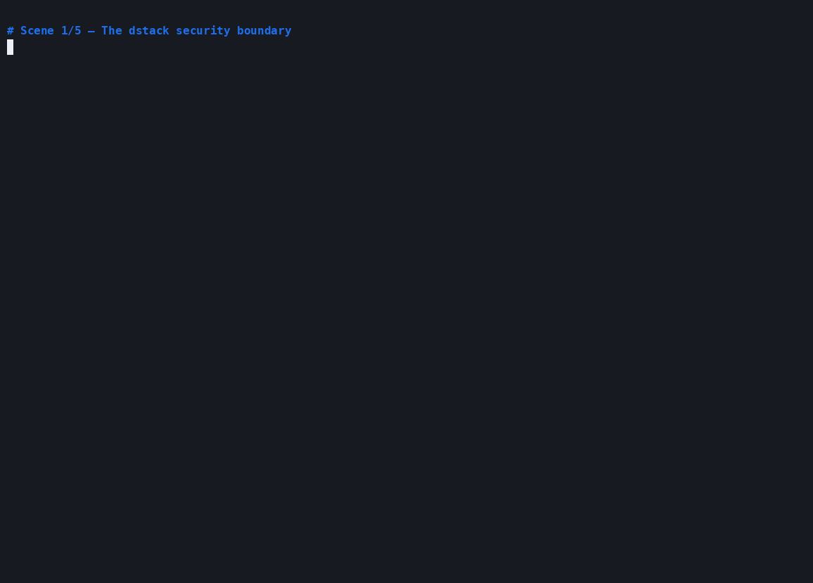

# Polign memory demo on dstack

This deployment runs the complete memory application inside one dstack
confidential VM:

- the browser chat and read-only memory inspector
- Polign's durable vector and typed-metadata store
- an authenticated gateway as the only published service
- encrypted model-provider credentials supplied at deployment time
- persistent volumes for Polign state and the public embedding-model cache

Polign's HTTP and gRPC data planes are not published. Only the memory
application can reach them on the private Compose network.

## Demo

### S3 machine failover


This is the stronger durability scenario. Node A writes seven typed records to
an S3-backed Polign 0.4.3 store, is killed without a graceful shutdown, and has
all of its containers, caches, and local volumes deleted. Node B starts as an
independent Compose project, recovers the profile from S3, and continues in a
new OpenAI conversation. It replaces Seattle with Portland and Go with Rust
while retaining the old values as superseded history.

### Single-machine process restart



The recording runs the dstack Compose workload locally with OpenAI. It shows
the authenticated gateway, private Polign data plane, typed memory inspector,
process restarts with durable recall, and cardinality-driven supersession. A
local recording demonstrates the workload behavior; hardware attestation is
available only after deploying the same workload to a dstack confidential VM.

## Local validation

The local override builds the memory application from this checkout. Direct
startup requires the selected provider's API key. The smoke test supplies a
nonfunctional placeholder because it validates startup, authentication, and
routing without sending a model request.

```sh
cd dstack
export DSTACK_PASSWORD="$(openssl rand -hex 32)"
export ANTHROPIC_API_KEY=...
docker compose -f docker-compose.yaml -f docker-compose.local.yaml \
  up -d --build --wait
```

Open <http://127.0.0.1:8080> and sign in as `polign` with the generated
password. The **inspect memories** link shows the typed records and their
supersession history.

Run `./smoke-test.sh` to build the image and verify that anonymous access is
rejected while health, authenticated UI, and inspector routes work.

## Record the OpenAI dstack demo

Create `dstack/.env` from `.env.example`, select the OpenAI provider, and add
`OPENAI_API_KEY`. The file is ignored by Git. Then run:

```sh
./dstack/record-demo.sh
```

This updates the repository's `dstack/dstack-openai-demo.gif` and produces a
local, Git-ignored `dstack/dstack-openai-demo.cast`, without printing or
recording the credential. The capture runs the dstack Compose workload
locally, demonstrates authenticated ingress, restarts both the agent and
Polign, verifies durable recall, and displays supersession history.

### Record an S3 machine-failover demo

For a stronger failure scenario, configure `POLIGN_STORE` and the standard AWS
credential chain in `dstack/.env`, using an existing bucket and a dedicated
prefix. Then run:

```sh
./dstack/record-s3-failover-demo.sh
```

The recorder starts Machine A, writes a typed user profile, kills the agent and
Polign without a graceful shutdown, and deletes all of Machine A's local
volumes. It then starts Machine B as a separate Compose project against the
same S3 prefix. A new OpenAI conversation recalls the profile, updates two
single-valued facts, and displays their cross-machine supersession history.

This proves durable memory continuity, not transcript persistence: the model's
message history dies with Machine A. Machine B continues from records recovered
from S3, which is the behavior this memory architecture is designed to provide.

The command updates the repository's `dstack/dstack-s3-failover-demo.gif` and
produces a local, Git-ignored `.cast` file. Neither the AWS credentials nor the
configured bucket URI are written to the recording.

## Publish the application image

The repository workflow publishes multi-architecture images to
`ghcr.io/polign/polign-memory-demo`. Its job summary prints the immutable
`image@sha256:...` reference. Use that digest for dstack; do not deploy a
mutable `latest` or branch tag because the image identity is part of what the
attested Compose configuration is meant to describe.

Polign itself is not redistributed in this application image. `polign-init`
downloads the official 0.4.3 Linux release for the CVM architecture and
checks its pinned SHA-256 digest before the database starts.

## Deploy to Phala Cloud

Choose an immutable application image, generate browser credentials, and pass
the model credential as an encrypted variable:

```sh
export MEMORY_DEMO_IMAGE='ghcr.io/polign/polign-memory-demo@sha256:<digest>'
export DSTACK_PASSWORD="$(openssl rand -hex 32)"

phala auth login
phala deploy -n polign-memory -c docker-compose.yaml \
  -e MEMORY_DEMO_IMAGE="${MEMORY_DEMO_IMAGE}" \
  -e DSTACK_USERNAME=polign \
  -e DSTACK_PASSWORD="${DSTACK_PASSWORD}" \
  -e ANTHROPIC_API_KEY="${ANTHROPIC_API_KEY}"
```

Open the port-8080 endpoint reported by Phala Cloud. Its TLS gateway protects
the browser's Basic Auth exchange; never expose this Compose port without TLS.

To use OpenAI instead:

```sh
phala deploy -n polign-memory -c docker-compose.yaml \
  -e MEMORY_DEMO_IMAGE="${MEMORY_DEMO_IMAGE}" \
  -e DSTACK_USERNAME=polign \
  -e DSTACK_PASSWORD="${DSTACK_PASSWORD}" \
  -e MODEL_PROVIDER=openai \
  -e MODEL=gpt-5 \
  -e OPENAI_API_KEY="${OPENAI_API_KEY}"
```

`OPENAI_BASE_URL` can point the same client at an OpenAI-compatible inference
endpoint. Set it together with that endpoint's token and model name.

## Security boundaries

- dstack attests the Compose workload and its image references. Pin the memory
  application image by digest and verify the deployment's attestation before
  sharing sensitive memories.
- Phala Cloud preserves and encrypts named volumes across restarts and
  upgrades. Deleting the CVM is not a backup strategy.
- `-trace=false` prevents typed memory tool inputs and results from reaching
  container logs. Also configure the deployment itself to keep logs private.
- The model provider still receives the conversation and tool exchange. A TEE
  protects this application's execution and stored memory; it does not make a
  third-party model API oblivious to requests sent to it.
- The browser gateway is a single-user demonstration boundary, not a
  multi-tenant identity system. Deploy one instance per trust domain.
- The unauthenticated Polign data plane stays private. Do not publish ports
  `23000` or `23001`.

## Persistence model

Polign runs with `-store fs:/var/lib/polign/store`, so acknowledged writes go
to its write-ahead log on the persistent volume before returning. Recreating
the application and database containers retains the same memory state.

For a multi-CVM production service, replace the filesystem store with a cloud
object store and use the platform's encrypted variables or workload identity
for credentials. That is a separate scaling design; this example intentionally
demonstrates one confidential VM with one durable trust boundary.
